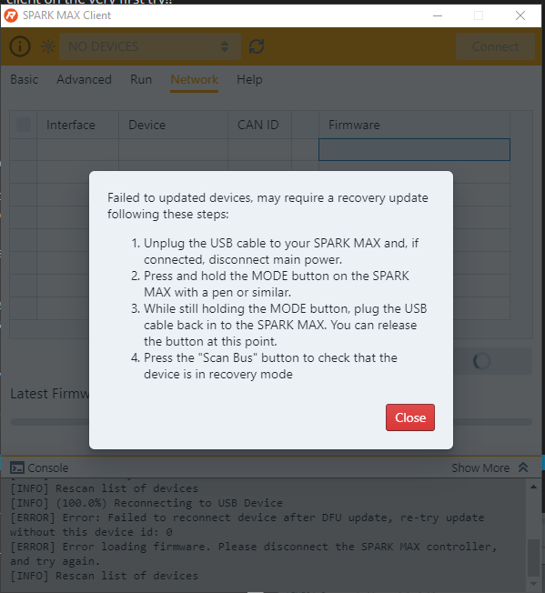

Troubleshooting REV Hardware devices
====================================

SparkMax Motor Controllers Not Updating
---------------------------------------
Try updating the SparkMax initially through the REV Hardware Client. If the SparkMax does not show up in there, proceed below.

If the SparkMax refuses to update and continually returns the error message "Failed to update devices, may require a recovery update following these steps:"

It probably **doesn't** require those steps. To rule out all possibilties, follow the guide once in its entirety, but usually you have to do the below steps to update your SparkMaxes.

#. Open `REV SPARK MAX Client`. For me, the SparkMaxes only showed up in the SPARK MAX Client, not the Hardware Client.
#. Go to the `Network` tab and select your SparkMax, and try loading the latest released firmware. At this point, you should get the Error Message shown in the image referenced above. 
#. Now, you will switch over to the `REV Hardware Client`. Here, you should be able to see a device in Recovery Mode. This is your SparkMax.
#. Proceed to load the firmware on to the Recovery Bus through the `REV Hardware Client`. With this, you should have updated SparkMaxes!

