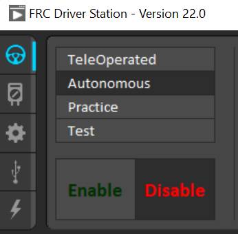

Troubleshooting DriverStation
===================================

Most problems you will face with the DriverStation are with the communication with the roboRIO. Try the below fixes if this is happening to you.

.. note::

   This page will be updated as we are alerted of more problems and fixes.

Setting Your Team Number
------------------------
In order to have the DriverStation be able to communicate with your roboRIO, the two must have the same Team Number set. You may do this by clicking on the settings cog 

And then editing the team number text box from :guilabel:`xxyy` to your team number.

Turning Off Your Firewall
----------------------------------------------
Often, DriverStation cannot connect due to the firewall blocking the communication to the roboRIO. Turn it off, and try restarting DriverStation.
If this doesn't work, try turning off virus protection as well.