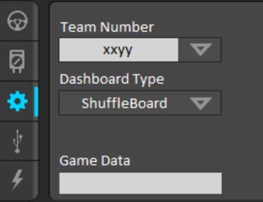

Troubleshooting DriverStation
===================================

Most problems you will face with the DriverStation are with the communication with the roboRIO. Try the below fixes if this is happening to you.

.. note::

   This page will be updated as we are alerted of more problems and fixes.

Setting Your Team Number
------------------------

In order to have the DriverStation be able to communicate with your roboRIO, you must set the two to your team number. To set the DriverStation's number, you may click on the settings cog to open the relevant menu.

.. image:: images/driverstation_settings_cog.png
   :width: 200
   :alt: Driverstation settings

From there, you can change the :guilabel:`xxyy` box to your team number.

To change the team number on your roboRIO, click `here <https://code.visualstudio.com/download>`_.

Turning Off Your Firewall
----------------------------------------------
Often, DriverStation cannot connect due to the firewall blocking the communication to the roboRIO. Turn it off, and try restarting DriverStation.
If this doesn't work, try turning off virus protection as well.